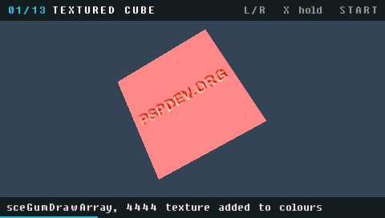

# PSP Graphics Demo

A homebrew demo for the PlayStation Portable that walks through what the
PSP's Graphics Engine can do, one technique per scene. Every scene is a
condensed, running version of one of the [pspsdk GU samples](https://github.com/pspdev/pspsdk/tree/master/src/samples/gu),
so the source doubles as a tour of the `sceGu` API. Tested in **PPSSPP 1.20.4**;
nobody has run it on real hardware yet.



The full run, 104 seconds at thirty frames per second: [docs/demo.mp4](docs/demo.mp4).

## Scenes

| # | Scene | What the GE is doing | Sample |
|---|---|---|---|
| 1 | Textured cube | `sceGumDrawArray`, a 4-bit-alpha texture added onto vertex colours | cube |
| 2 | Hardware lights | four point lights, diffuse and specular, lit per vertex | lights |
| 3 | Environment map | `GU_ENVIRONMENT_MAP`, the 2×2 matrix rides in light slots 2 and 3 | envmap |
| 4 | Cel shading | a 1D lightmap sampled through envmap coordinates, inflated hull for the outline | celshading |
| 5 | Morph targets | `GU_VERTICES(2)`, sphere and cube blended by `sceGuMorphWeight` | morph |
| 6 | Matrix skinning | eight bone matrices, cubic B-spline weights per vertex | skinning |
| 7 | Spline surface | `sceGumDrawSpline` tessellates an 18×18 control net on the GE | splinesurface |
| 8 | Render to texture | a torus drawn into a 128×128 VRAM target, then mapped onto a cube | rendertarget |
| 9 | Stencil mirror | the mirror marks the stencil, the flipped cube draws only inside it | reflection |
| 10 | Projected shadow | a shadow map from the light's view, projected through `GU_TEXTURE_MATRIX` | shadowprojection |
| 11 | Depth buffer fog | the z-buffer read back as an 8-bit texture through a fog palette | zbufferfog |
| 12 | Sprite cloud | 16384 `GU_SPRITES` billboards, alpha test cuts out the ball | sprite |
| 13 | Palette cycling | an 8-bit XOR texture whose 256-entry CLUT is rewritten every frame | clut |

Scenes advance on their own every eight seconds and loop.

## Controls

Every scene is a toy, not a video: the stick has hold of whatever the scene
is about, and each one carries its own knob and two switches. Touch anything
and the autoplay holds, so the scene stays put while you work on it. The
bottom band then draws the pad: the scene's five controls on one row, what
every scene answers to on the next, and the top right holds the settings
they are on.

| PSP | Action |
|---|---|
| Analog stick | the handle: turns the object, walks the light around, bends the bones |
| D-pad up / down | camera closer, further away |
| D-pad left / right | the scene's knob |
| Square, Circle | the scene's two switches |
| Triangle | freeze the scene where it stands |
| Select | the scene back to its defaults |
| L / R | previous / next scene |
| Cross | hold the autoplay, press again to resume |
| Start, or Home | exit |

What the handle, the knob and the switches do, scene by scene:

| # | Scene | Stick | D-pad left/right | Square | Circle |
|---|---|---|---|---|---|
| 1 | Textured cube | turn the cube | texture repeats, 1 to 8 | texture function | filter |
| 2 | Hardware lights | carry the ring of lights around and up | how shiny | how many lights, 1 to 4 | point, spot or directional |
| 3 | Environment map | turn the torus | spin the 2x2 matrix by hand | how far the map stretches | the tinting light on or off |
| 4 | Cel shading | turn the torus | carry the lamp around | base colour | outline width, including none |
| 5 | Morph targets | turn the shape | blend sphere to cube by hand | back to the automatic blend | flat or smooth shading |
| 6 | Matrix skinning | bend and twist the bone chain | turn the model | how many arms, 1 to 4 | keep the pose, or let it swing back |
| 7 | Spline surface | turn the surface | divisions per patch, 1 to 32 | another harmonic | filled, wireframe or points |
| 8 | Render to texture | turn the cube | spin the torus inside the texture | target size, 128 down to 16 | filter |
| 9 | Stencil mirror | walk the camera around the mirror | lift the cube | how much mirror is left in front | the stencil test on or off |
| 10 | Projected shadow | carry the lamp around and up | orbit the camera | how far the lamp hangs | show the shadow map itself |
| 11 | Depth buffer fog | turn the torus | where the fog starts | fog colour | the raw depth buffer instead |
| 12 | Sprite cloud | turn the cloud | sprite size | how many, 16384 down to 256 | the alpha test on or off |
| 13 | Palette cycling | pan the texture | cycling speed, backwards too | palette | filter |

A scene nobody touches draws exactly what it always did, so the recording
below is still what the demo does on its own.

## Downloads

Get `psp-graphicsdemo.zip` from the [latest release](https://github.com/chriopter/psp-graphicsdemo/releases/latest).
It contains `PSP/GAME/GraphicsDemo/EBOOT.PBP`; copy the `PSP` folder to a
Memory Stick, or open the EBOOT in PPSSPP.

Pushing a `v*` tag builds the same zip in CI and attaches it to a release.
The app is listed in [PSPDX](https://github.com/chriopter/pspdx): `app.pspdx`
in the root describes it, and the release action fills in the release half at
every tag.

## Building

Requirements: Docker. The pspdev toolchain image does the rest.

```sh
./build.sh          # -> EBOOT.PBP
./run-ppsspp.sh     # opens it in PPSSPPSDL or the PPSSPP flatpak
tools/package.sh    # -> dist/psp-graphicsdemo.zip
```

Without Docker, `make` works against any pspdev install that has
`psp-config` on the PATH.

## How the recording is made

PPSSPP's headless build cannot save screenshots by itself, so the demo
records itself: when `ms0:/PSP/GRAPHICSDEMO.REC` exists it appends every
second frame, raw, to `ms0:/PSP/GRAPHICSDEMO.RAW` and exits when the run is
over. Frames are exact emulated vblanks, so timing does not depend on host
speed. `tools/make-video.sh` sets that up, runs PPSSPPHeadless, and renders
the MP4 and GIF with ffmpeg. Needs PPSSPPHeadless and ffmpeg.

## Layout

```
src/main.c         GU setup, scene loop, pad, overlay
src/scene_*.c      one technique each: init() builds geometry, reset() the
                   settings, draw(frame, input) renders and reads the pad
src/text.c         2D text from the pspsdk font sheet
src/geometry.c     torus and grid generators from the pspsdk samples
assets/*.raw       textures from the samples, linked with bin2o
tools/             video and packaging scripts
```

## License

BSD 3-Clause, see [LICENSE](LICENSE). The scene code and textures are
adapted from the pspsdk samples, which carry the same license.
